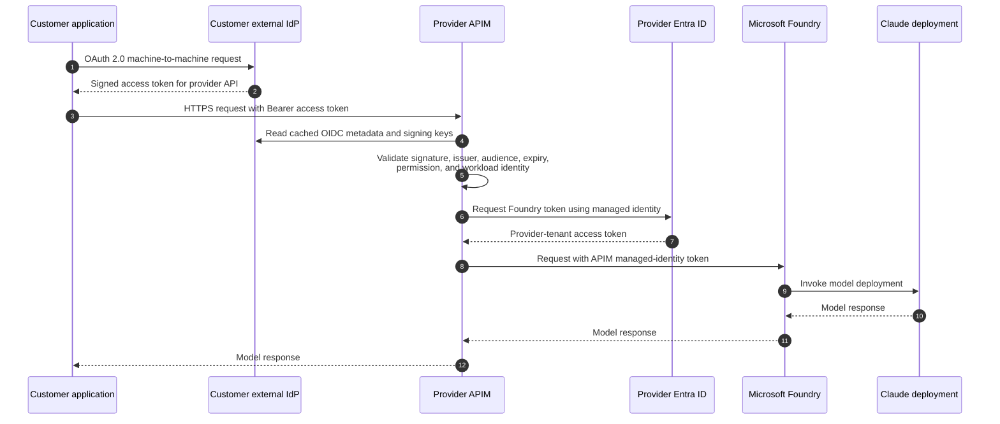

# Non-Entra Customer Authentication

This guide describes how a customer application can call the provider's Azure
API Management (APIM) gateway when the customer uses an identity provider
(IdP) other than Microsoft Entra ID. Examples include Okta, Ping Identity,
Auth0, Keycloak, Google Cloud, and a standards-compliant enterprise OIDC
provider.

The recommended design is for APIM to validate the customer's OAuth 2.0 access
token directly. Microsoft Entra ID remains in the provider tenant because APIM
uses its managed identity to call Microsoft Foundry, but the customer does not
need an Entra tenant, app registration, enterprise application, or cross-tenant
consent.

## Identity boundary

There are two independent authentication hops:

```text
Customer application -- external IdP token --> Provider APIM
Provider APIM        -- managed identity ----> Microsoft Foundry
```

The customer's token stops at APIM. APIM validates it, applies customer-specific
authorization and quotas, removes headers that callers must not control, and
then obtains a new provider-tenant token for Foundry using its managed identity.
Foundry never receives or needs to understand the customer's external identity.

## Recommended design: direct OIDC trust

Use direct trust when the customer IdP can issue a signed OAuth 2.0 access token
for a machine workload and publishes standards-compliant OpenID Connect (OIDC)
discovery and JSON Web Key Set (JWKS) endpoints.



### Customer IdP requirements

The IdP must provide:

- An HTTPS OIDC issuer and discovery document.
- A reachable JWKS endpoint with asymmetric signing keys and stable key IDs.
- OAuth 2.0 client credentials or an equivalent workload flow. This is an
  application-to-application integration, not an interactive user sign-in.
- An access token whose `aud` identifies this provider API specifically.
- A stable claim that identifies the calling workload, such as `client_id`,
  `azp`, or `sub`.
- An authorization claim, such as `scope`, `scp`, `roles`, or `permissions`,
  containing an agreed permission such as `model.invoke`.
- Short token lifetimes and a documented signing-key rotation process.

The customer must send an **access token**, not an ID token. A token issued for
another API must not be accepted even if its signature is valid.

### Provider APIM validation

For a non-Entra issuer, use APIM's `validate-jwt` policy. The following is a
template; claim names and values must be agreed with each IdP.

```xml
<validate-jwt
    header-name="Authorization"
    require-scheme="Bearer"
    require-expiration-time="true"
    require-signed-tokens="true"
    failed-validation-httpcode="401"
    failed-validation-error-message="Access token is missing or invalid."
    output-token-variable-name="customerJwt">
    <openid-config url="https://idp.customer.example/.well-known/openid-configuration" />
    <audiences>
        <audience>https://api.provider.example/model</audience>
    </audiences>
    <issuers>
        <issuer>https://idp.customer.example/</issuer>
    </issuers>
    <required-claims>
        <claim name="scope" match="any" separator=" ">
            <value>model.invoke</value>
        </claim>
        <claim name="client_id" match="any">
            <value>approved-customer-workload-id</value>
        </claim>
    </required-claims>
</validate-jwt>
```

Validation must cover all of the following:

| Check | Purpose |
|---|---|
| Cryptographic signature and approved algorithm | Proves the token was signed by the trusted IdP |
| Exact `iss` | Prevents tokens from an unapproved issuer or IdP environment |
| Exact `aud` | Prevents reuse of tokens issued for another API |
| `exp` and, when present, `nbf` | Rejects expired or not-yet-valid tokens |
| Required permission | Proves the workload is authorized to invoke the model API |
| Approved client/workload identifier | Restricts access to the onboarded application |

Do not authorize a request using only a valid signature, issuer, or network
location. Derive the customer identity used for quotas, logging, and billing
from validated token claims rather than from a caller-supplied header.

### IdP metadata connectivity

APIM periodically reads the OIDC discovery document and JWKS to obtain signing
keys and handle key rotation. The APIM gateway must be able to resolve and
reach those endpoints over HTTPS. This requirement also applies when the APIM
gateway is private or uses outbound VNet integration.

If the customer's IdP is private and cannot be reached by provider APIM, choose
one of these designs:

1. Publish only the OIDC metadata and public signing keys through an approved
   reachable endpoint. No private key or token endpoint is exposed by doing so.
2. Establish an explicitly approved network path from APIM to the IdP metadata
   endpoint.
3. Use the federation option below so provider Entra performs the external-token
   validation.
4. Use mTLS or an APIM subscription credential if OIDC integration is not
   feasible.

## Alternative: federate the external IdP with provider Entra

This option preserves the existing Entra-token contract at APIM. The provider
creates an application identity in the **provider Entra tenant** and configures
a federated identity credential that trusts a specific external issuer,
subject, and audience.

```text
1. Customer workload obtains a signed assertion from its external IdP.
2. Customer workload sends that assertion to the provider Entra token endpoint.
3. Provider Entra validates the configured issuer, subject, and audience.
4. Provider Entra issues an access token for the APIM API.
5. Customer workload calls APIM with the provider Entra access token.
6. APIM validates the Entra token and calls Foundry with its managed identity.
```

Use this option when the provider requires one standardized Entra token format
at APIM or already has authorization and governance built around Entra claims.
It adds a token exchange, provider-side identity lifecycle, and tighter coupling
to the provider tenant. The external issuer must support the OIDC token shape
required for workload identity federation, and the configured `issuer`,
`subject`, and `audience` must match the external token exactly.

## Fallback: APIM credential with optional mTLS

If the customer IdP cannot issue suitable workload access tokens, APIM can
authenticate the caller with a per-customer subscription key. For a stronger
production design, combine a per-customer APIM credential with mutual TLS
(mTLS), short rotation intervals, and source-network restrictions.

This approach is simpler but has weaker identity semantics than OAuth:

- A key proves possession of a secret, not the identity of the running workload.
- Rotation and revocation are provider/customer operational tasks.
- Credentials must never be shared across customers or environments.
- Keys and client certificates must not be logged or stored in source control.

## Networking remains independent

Both customer connectivity options in this repository still apply:

- **Private Link:** the customer reaches APIM through a private endpoint without
  VNet peering. The application may still need outbound access to its IdP token
  endpoint.
- **Public APIM endpoint:** TLS and a stable customer egress IP allow-list limit
  the network path. JWT authentication remains mandatory.

Private Link and IP allow-listing establish where traffic can come from. They do
not establish which workload is calling and must not replace authentication.

## Ownership and onboarding

| Customer responsibility | Provider responsibility |
|---|---|
| Configure a machine workload/client in the external IdP | Approve the issuer and token contract |
| Configure the API audience and permission | Configure APIM `validate-jwt` policy |
| Supply issuer, discovery URL, audience, claim names, and approved client ID | Validate issuer, audience, permission, and workload identity |
| Protect workload credentials or use customer-side federation | Map validated identity to customer quota and billing records |
| Notify the provider before issuer, claim, or key-rotation changes | Monitor authentication failures and metadata/JWKS retrieval |
| Provide Private Link or stable egress details | Maintain APIM-to-Foundry managed identity and private backend path |

For each customer and environment, record an approved authentication profile:

```text
Customer and environment:
OIDC issuer (`iss`):
OIDC discovery URL:
Expected API audience (`aud`):
Authorization claim and required value:
Workload identity claim and approved value:
Token lifetime:
Signing algorithms:
JWKS/key-rotation contact:
Network path and source identifiers:
Operational and incident contacts:
```

Use separate audiences, clients, permissions, and quotas for production and
non-production environments wherever the IdP supports that isolation.

## Validation checklist

Test from the actual customer workload and network path:

- A valid token with the expected issuer, audience, permission, and client ID
  reaches the model API.
- A request without a token returns `401`.
- An ID token is rejected.
- A token for another API audience is rejected.
- A token from an unapproved issuer or IdP environment is rejected.
- A valid token for an unapproved client is rejected.
- A token without the required permission returns `401` or `403` as designed.
- Expired and not-yet-valid tokens are rejected.
- A signing-key rotation succeeds after APIM refreshes the IdP metadata/JWKS.
- APIM logs the derived customer and workload identity without logging the token.
- Foundry logs show the provider APIM managed identity as the caller.
- Quotas and token limits are isolated by the validated customer identity.
- The same tests succeed through the selected Private Link or public path.

## Failure isolation

| Symptom | Boundary to investigate |
|---|---|
| APIM returns `401` for every token | OIDC discovery/JWKS reachability, signature algorithm, issuer, audience, or expiry |
| APIM returns `403` for an otherwise valid token | Permission claim, workload/client allow-list, product, or quota policy |
| Calls fail after IdP key rotation | JWKS publication, `kid`, APIM metadata refresh, or outbound connectivity |
| Token acquisition fails before APIM is called | Customer IdP client, grant, audience, permission, or customer network |
| APIM returns `502` or `503` | Provider APIM-to-Foundry DNS, route, private endpoint, or backend health |
| Foundry returns `401` or `403` | APIM managed-identity audience or provider-side Foundry RBAC |

## Impact on this repository

The current Terraform implementation is Entra-specific:

- The provider policy uses `validate-azure-ad-token` with a customer tenant ID.
- The provider root creates a multitenant Entra API application and app role.
- The customer root creates Entra client/service-principal objects and assigns
  the provider application role.

Therefore, this guide describes a supported architecture but the current IaC
does **not** yet provision it. Enabling direct external OIDC requires a separate
authentication mode in the provider Terraform, external issuer/audience/claim
variables, a `validate-jwt` policy variant, and a customer path that skips the
Entra application and consent resources. APIM managed identity, Foundry RBAC,
Foundry private networking, and customer-to-APIM Private Link remain unchanged.

## Decision summary

| Situation | Recommended option |
|---|---|
| Customer IdP issues suitable workload access tokens and exposes OIDC metadata | Direct OIDC validation at APIM |
| Provider requires a single Entra token contract at APIM | External IdP federation with provider Entra |
| Customer IdP cannot support workload OAuth/OIDC | Per-customer APIM credential, preferably with mTLS |
| Pilot where speed matters more than identity assurance | APIM subscription key with a migration plan |

For most non-Entra customers, direct OIDC validation is the shortest and least
coupled production path.

## Microsoft references

- [APIM `validate-jwt` policy](https://learn.microsoft.com/azure/api-management/validate-jwt-policy)
- [Microsoft Entra workload identity federation](https://learn.microsoft.com/entra/workload-id/workload-identity-federation)
- [Trust an external identity provider from an Entra application](https://learn.microsoft.com/entra/workload-id/workload-identity-federation-create-trust)
