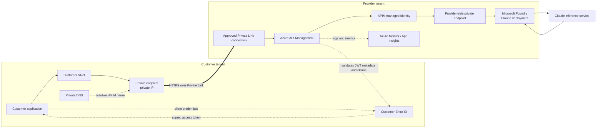
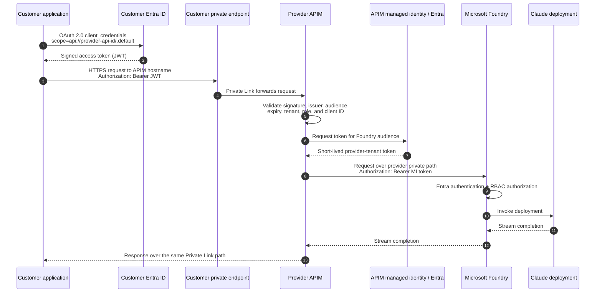

# Private Link: Customer Tenant to Provider APIM

This option gives the customer application a private IP path to Azure API Management (APIM) in the provider tenant. The customer and provider networks are **not peered**. Azure Private Link carries the traffic over the Microsoft backbone, while Microsoft Entra ID and APIM policies establish who is allowed to call the API.

Private Link and authentication solve different problems:

- **Private Link** controls how the request reaches APIM.
- **Microsoft Entra ID and the JWT** identify and authorize the calling workload.
- **APIM managed identity** identifies APIM to Microsoft Foundry. The customer's identity is not forwarded to Foundry.

> The correct term is **JWT** (JSON Web Token), sometimes mistyped as "JTW."

## End-to-end architecture

The response follows the same path in reverse. No VNet peering, site-to-site VPN, or customer route into the provider VNet is required.

## What each tenant owns

| Customer tenant | Provider tenant |
|---|---|
| Calling application or workload | Multitenant Entra API application representing the APIM API |
| Workload app registration or managed workload identity | APIM instance, API, products, policies, quotas, and logs |
| Enterprise application for the provider API after consent | Private Link connection approval |
| VNet, private-endpoint subnet, private endpoint, and private DNS | APIM managed identity and Foundry RBAC assignment |
| NSGs, outbound controls, and application secrets/certificates | Provider VNet, Foundry private endpoint, private DNS, and APIM outbound networking |
| Correlation ID added to each request | Correlated APIM and Foundry diagnostics |

## One-time provider setup

### 1. Expose APIM as an Entra-protected API

The recommended production pattern is a **multitenant API app registration in the provider Entra tenant**:

1. Create an app registration representing the API exposed through APIM.
2. Set the supported account type to allow organizational directories that will call the API.
3. Set an Application ID URI, for example `api://<provider-api-application-id>`.
4. Define an application role such as `Model.Invoke`, allowed for applications.
5. Record the provider API application ID and expected audience.
6. Use a separate app registration per environment where isolation requires it.

The provider API registration describes the resource being called. It does not give the customer access by itself.

### 2. Configure APIM inbound authentication

On the model API or operation, configure an inbound policy that:

1. Requires HTTPS.
2. Reads the bearer token from the `Authorization` header.
3. Validates the JWT signature through Entra OpenID configuration.
4. Validates `exp` and `nbf` automatically and requires the expected `aud` value.
5. Accepts only approved tenant issuers. For a controlled customer list, validate the token's tenant ID (`tid`) and issuer against that list.
6. Requires the `Model.Invoke` application role and, where appropriate, the approved client application ID from `azp` or `appid`.
7. Applies per-customer quota, token limit, and logging policies only after authentication succeeds.
8. Removes or overwrites headers that callers must not control before forwarding the request.

For multitenant tokens, do not validate only the signature and audience. Tenant and authorization claims must also be checked, or any consented tenant may be broader than intended.

### 3. Enable APIM inbound Private Link

1. Select an APIM SKU and topology that support the required inbound private endpoint and provider-side VNet connectivity features.
2. Enable private endpoint connectivity for the APIM gateway.
3. Decide whether APIM's public network access will remain enabled. For a private-only design, disable it after private-path validation.
4. Give the customer the APIM resource ID, gateway hostname, target subresource/group ID, region, and an approval contact.
5. Keep the normal APIM hostname on the TLS request. Private Link changes name resolution and routing; it does not remove TLS hostname validation.

Inbound Private Link only makes APIM reachable privately. It does not automatically make APIM-to-Foundry traffic private.

### 4. Configure APIM to reach Foundry

1. Enable a system-assigned or dedicated user-assigned managed identity on APIM.
2. Grant that identity the least-privileged Foundry data-plane role required to invoke the deployment. `Cognitive Services User` is commonly used; confirm the exact role for the selected Foundry resource and endpoint.
3. Create a private endpoint for the Foundry resource in the provider network.
4. Link the appropriate Foundry private DNS zone to the network used by APIM.
5. Configure APIM outbound VNet connectivity so it can resolve and route to the Foundry private endpoint.
6. Configure the APIM backend with the Foundry endpoint and deployment details.
7. Use APIM managed-identity authentication to request a short-lived Entra access token for the Foundry resource audience.
8. Disable Foundry public network access after the private backend path has been tested, if required by the security design.

The managed identity belongs to the provider tenant. The customer never receives a Foundry key or a token valid directly against Foundry.

## One-time customer setup

### 1. Establish the workload identity

1. Register the customer workload in the customer Entra tenant, or use an existing confidential-client registration.
2. Prefer a certificate or workload identity federation for production. If a client secret is used, store it in Key Vault and rotate it.
3. Have a customer administrator consent to the provider's multitenant API application.
4. Assign the provider API's `Model.Invoke` application role to the customer workload's service principal.
5. Record the customer tenant ID, workload client ID, provider API audience, and provider-approved APIM hostname.

For client credentials, the application requests the token from the **customer tenant's token endpoint**. Entra issues a token whose audience is the provider API and whose application permissions appear in the `roles` claim. There is no end-user identity in this flow.

### 2. Create the private endpoint

1. Create or select a subnet for private endpoints. Apply the subnet settings required by Azure Private Endpoint networking.
2. Create a private endpoint using the provider's APIM resource ID and the APIM gateway subresource/group ID.
3. Supply a meaningful connection name containing the customer and environment names.
4. Send the resulting connection request ID to the provider for approval.
5. Wait until the connection state is `Approved` before testing.

The private endpoint is a network interface with a private IP in the customer VNet. It does not expose the provider VNet or create transitive routing.

### 3. Configure private DNS

1. Use the Azure private DNS zone required by APIM Private Link, or add equivalent records to the customer's enterprise DNS service.
2. Link the private DNS zone to every VNet from which the application must resolve APIM.
3. If the caller is on-premises, configure conditional forwarding through an Azure DNS resolver path.
4. Verify that the APIM gateway hostname resolves to the private endpoint IP from the application network.
5. If APIM uses a custom domain, keep its certificate and DNS name intact and map that name to the private endpoint IP in the customer's private DNS design.

Do not replace the APIM URL in application code with a raw private IP. TLS and HTTP host routing require the hostname.

### 4. Permit the application path

Allow the application to reach the private endpoint on TCP 443 through its NSG, host firewall, and any network virtual appliance. Also permit the workload's required outbound access to Microsoft Entra token endpoints and certificate/metadata endpoints. Private Link for APIM does not make the OAuth token request private.

## Runtime request flow

### What APIM resolves during authentication

APIM validates the customer's token; it does not exchange that token for a Foundry token. A useful authorization mapping is:

| JWT value | APIM use |
|---|---|
| `iss` and `tid` | Confirm the issuing customer tenant is approved |
| `aud` | Confirm the token was issued for this provider API |
| `roles` | Confirm application permission such as `Model.Invoke` |
| `azp` or `appid` | Identify the customer workload application |
| `exp`, `nbf` | Reject expired or not-yet-valid tokens |
| `jti` | Troubleshooting and token-event correlation; not a business identity |

APIM can then map the approved tenant/client pair to a product, subscription, quota key, cost center, or internal customer ID. Never trust a caller-supplied customer ID without deriving or cross-checking it against validated claims.

## Subscription-key alternative

Private Link can also be used with an APIM subscription key. In that case:

1. The customer skips the Entra token request.
2. The request carries `Ocp-Apim-Subscription-Key` or an agreed custom header.
3. APIM resolves the key to the customer's APIM subscription and product.
4. The APIM-to-Foundry managed identity flow remains unchanged.

This is simpler for a pilot but provides weaker workload identity and requires careful key storage and rotation. The private network path does not compensate for a shared or leaked key.

## Validation checklist

Run these checks from the same network and DNS context as the application:

- APIM hostname resolves to the customer's private endpoint IP.
- TCP 443 connects and the APIM certificate matches the requested hostname.
- The private endpoint connection shows `Approved` on both sides.
- A request without credentials returns `401`, not a backend response.
- A token with the wrong audience, tenant, role, or client ID returns `401` or `403` as designed.
- A valid token reaches APIM and APIM logs the validated customer identity.
- Foundry logs show APIM's managed identity as the caller, not the customer workload.
- Foundry's public endpoint is unreachable when public network access is disabled.
- Request and response logs share a correlation ID without recording prompts, tokens, secrets, or authorization headers unless explicitly approved.

## Common failures

| Symptom | Most likely boundary to check |
|---|---|
| APIM name resolves publicly | Private DNS zone link, custom DNS forwarding, or record set |
| Private endpoint remains pending | Provider approval and correct APIM subresource/group ID |
| TLS hostname mismatch | Application used the private IP or an unconfigured custom hostname |
| `401` at APIM | Missing token, signature/issuer/audience mismatch, or expired token |
| `403` at APIM | Tenant, client application, role, product, or quota policy rejected the caller |
| `502`/`503` from APIM | Provider-side Foundry DNS, route, private endpoint, or backend health |
| `401`/`403` from Foundry | APIM managed-identity token audience or Foundry RBAC assignment |

## Security outcome

The customer controls who can originate traffic in its network and which workload can obtain an Entra token. The provider controls which private endpoint is approved, which tenants and applications APIM accepts, and what the APIM managed identity may do in Foundry. Compromise of the customer credential does not grant direct access to Foundry, and Private Link does not create general network access between the two tenants.