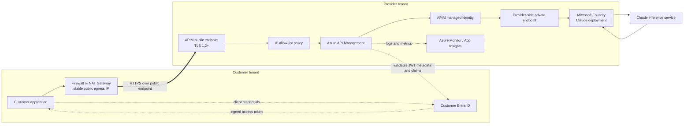
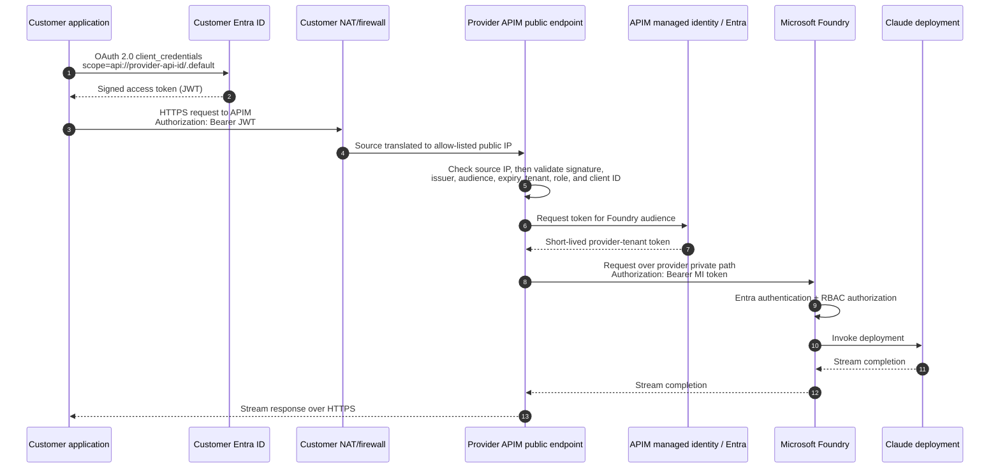

# Public Endpoint: Customer Tenant to Provider APIM

This option sends the customer application's HTTPS request to the public Azure API Management (APIM) gateway. The provider restricts ingress to known customer egress IP addresses, and APIM authenticates every request. There is no private endpoint, VNet peering, or VPN between the tenants.

The controls are layered and independent:

- **TLS** encrypts the request in transit and authenticates the APIM hostname.
- **IP allow-listing** limits which network egress points may reach APIM.
- **Microsoft Entra ID and the JWT** identify and authorize the calling workload.
- **APIM managed identity** identifies APIM to Microsoft Foundry. The customer's identity is not forwarded to Foundry.

> The correct term is **JWT** (JSON Web Token), sometimes mistyped as "JTW."

## End-to-end architecture

Only the first network hop is public. APIM can still reach Foundry over a private endpoint entirely within the provider tenant.

## What each tenant owns

| Customer tenant | Provider tenant |
|---|---|
| Calling application or workload | Multitenant Entra API application representing the APIM API |
| Workload app registration or managed workload identity | APIM instance, public gateway, APIs, products, policies, quotas, and logs |
| Enterprise application for the provider API after consent | Inbound IP filtering and optional web application firewall controls |
| Firewall or NAT Gateway with stable public egress IPs | APIM managed identity and Foundry RBAC assignment |
| Outbound firewall rules and credential storage | Provider VNet, Foundry private endpoint, private DNS, and APIM outbound networking |
| Correlation ID added to each request | Correlated APIM and Foundry diagnostics |

## One-time provider setup

### 1. Expose APIM as an Entra-protected API

The recommended production pattern is a **multitenant API app registration in the provider Entra tenant**:

1. Create an app registration representing the API exposed through APIM.
2. Set the supported account type to allow organizational directories that will call the API.
3. Set an Application ID URI, for example `api://<provider-api-application-id>`.
4. Define an application role such as `Model.Invoke`, allowed for applications.
5. Record the provider API application ID and expected audience.
6. Use a separate app registration per environment where isolation requires it.

The provider API registration describes the resource being called. It does not give the customer access by itself.

### 2. Configure APIM inbound authentication

On the model API or operation, configure an inbound policy that:

1. Requires HTTPS.
2. Reads the bearer token from the `Authorization` header.
3. Validates the JWT signature through Entra OpenID configuration.
4. Validates `exp` and `nbf` automatically and requires the expected `aud` value.
5. Accepts only approved tenant issuers. For a controlled customer list, validate the token's tenant ID (`tid`) and issuer against that list.
6. Requires the `Model.Invoke` application role and, where appropriate, the approved client application ID from `azp` or `appid`.
7. Applies per-customer quota, token limit, and logging policies only after authentication succeeds.
8. Removes or overwrites headers that callers must not control before forwarding the request.

For multitenant tokens, do not validate only the signature and audience. Tenant and authorization claims must also be checked, or any consented tenant may be broader than intended.

### 3. Publish and restrict the APIM public endpoint

1. Configure the APIM gateway hostname and a trusted TLS certificate. Use TLS 1.2 or later.
2. Obtain all stable customer egress IPv4 and IPv6 addresses and their environment mappings through an authenticated operational process.
3. Enforce the allow-list at APIM, or at an approved upstream control such as Azure Front Door Premium with WAF. Keep one clear enforcement point as the source of truth.
4. Deny traffic from all other source addresses before expensive AI policies or backend calls run.
5. Keep authentication mandatory even for allow-listed addresses. A source IP identifies a network path, not a workload or user.
6. Define an emergency IP-change and rollback process before production cutover.
7. Monitor denied sources and unexpected changes without logging credentials or request content by default.

Do not allow-list broad cloud service-tag ranges when the requirement is to identify one customer. Shared platform egress can let unrelated workloads originate from an allowed address.

### 4. Configure APIM to reach Foundry

1. Enable a system-assigned or dedicated user-assigned managed identity on APIM.
2. Grant that identity the least-privileged Foundry data-plane role required to invoke the deployment. `Cognitive Services User` is commonly used; confirm the exact role for the selected Foundry resource and endpoint.
3. Create a private endpoint for the Foundry resource in the provider network.
4. Link the appropriate Foundry private DNS zone to the network used by APIM.
5. Configure APIM outbound VNet connectivity so it can resolve and route to the Foundry private endpoint.
6. Configure the APIM backend with the Foundry endpoint and deployment details.
7. Use APIM managed-identity authentication to request a short-lived Entra access token for the Foundry resource audience.
8. Disable Foundry public network access after the private backend path has been tested, if required by the security design.

The APIM public ingress setting has no requirement for Foundry itself to be public. These are separate APIM interfaces and separate network decisions.

## One-time customer setup

### 1. Establish the workload identity

1. Register the customer workload in the customer Entra tenant, or use an existing confidential-client registration.
2. Prefer a certificate or workload identity federation for production. If a client secret is used, store it in Key Vault and rotate it.
3. Have a customer administrator consent to the provider's multitenant API application.
4. Assign the provider API's `Model.Invoke` application role to the customer workload's service principal.
5. Record the customer tenant ID, workload client ID, provider API audience, and provider-approved APIM hostname.

For client credentials, the application requests the token from the **customer tenant's token endpoint**. Entra issues a token whose audience is the provider API and whose application permissions appear in the `roles` claim. There is no end-user identity in this flow.

### 2. Provide stable egress addresses

1. Route the application's internet-bound traffic through a customer-controlled Azure NAT Gateway, Azure Firewall, or equivalent fixed egress service.
2. Allocate static public IP resources and plan enough SNAT capacity for concurrent and streaming requests.
3. Ensure every application instance, availability zone, and disaster-recovery path uses an address supplied to the provider.
4. Send the addresses and environment labels to the provider through an authenticated channel.
5. Notify the provider before adding, replacing, or removing an egress address.

Do not use an automatically assigned outbound address that can change during scaling, redeployment, or failover.

### 3. Permit outbound dependencies

Allow the workload to resolve and reach:

- The APIM gateway hostname on TCP 443.
- The customer Entra token endpoint and required Entra metadata/certificate endpoints on TCP 443.
- Any customer-owned Key Vault or certificate service needed to authenticate the workload.
- DNS resolvers and time synchronization required for reliable TLS and token validation.

Use FQDN-aware rules where the egress platform supports them. Avoid pinning APIM or Entra destination IPs that Microsoft may change.

## Runtime request flow

### What APIM resolves during authentication

APIM validates the customer's token; it does not exchange that token for a Foundry token. A useful authorization mapping is:

| JWT value | APIM use |
|---|---|
| `iss` and `tid` | Confirm the issuing customer tenant is approved |
| `aud` | Confirm the token was issued for this provider API |
| `roles` | Confirm application permission such as `Model.Invoke` |
| `azp` or `appid` | Identify the customer workload application |
| `exp`, `nbf` | Reject expired or not-yet-valid tokens |
| `jti` | Troubleshooting and token-event correlation; not a business identity |

APIM can then map the approved tenant/client pair to a product, subscription, quota key, cost center, or internal customer ID. Never trust a caller-supplied customer ID without deriving or cross-checking it against validated claims.

## Subscription-key alternative

The public endpoint can also use an APIM subscription key. In that case:

1. The customer skips the Entra token request.
2. The request carries `Ocp-Apim-Subscription-Key` or an agreed custom header.
3. APIM resolves the key to the customer's APIM subscription and product.
4. Source IP filtering and TLS remain required.
5. The APIM-to-Foundry managed identity flow remains unchanged.

This is simpler for a pilot but provides weaker workload identity and requires careful key storage and rotation. An allow-listed source IP does not compensate for a shared or leaked key.

## Validation checklist

Run these checks from the same egress path as the application:

- APIM hostname resolves publicly and the certificate matches the hostname.
- The observed source address at the provider matches the customer's declared static egress IP.
- An allow-listed source reaches APIM; a non-allow-listed source is denied.
- A request without credentials returns `401` from an allowed source.
- A token with the wrong audience, tenant, role, or client ID returns `401` or `403` as designed.
- A valid token reaches APIM and APIM logs the validated customer identity.
- Foundry logs show APIM's managed identity as the caller, not the customer workload.
- Foundry's public endpoint is unreachable when public network access is disabled.
- Request and response logs share a correlation ID without recording prompts, tokens, secrets, or authorization headers unless explicitly approved.

## Common failures

| Symptom | Most likely boundary to check |
|---|---|
| Connection denied before APIM authentication | Actual customer egress IP, IPv6 path, allow-list, or upstream WAF |
| Intermittent access after scale-out or failover | A node or DR path uses an undeclared egress IP |
| Connection resets during streaming | Firewall/NAT idle timeout, SNAT exhaustion, or proxy buffering |
| `401` at APIM | Missing token, signature/issuer/audience mismatch, or expired token |
| `403` at APIM | Tenant, client application, role, product, quota, or source-IP policy rejected the caller |
| `502`/`503` from APIM | Provider-side Foundry DNS, route, private endpoint, or backend health |
| `401`/`403` from Foundry | APIM managed-identity token audience or Foundry RBAC assignment |

## Security outcome

The customer controls which workloads can obtain Entra tokens and which fixed egress points can send traffic. The provider independently controls the source-IP allow-list, accepted tenants and applications, APIM authorization, quotas, and the APIM managed identity's Foundry permissions. Traffic crosses a public endpoint but remains encrypted with TLS; Foundry can remain private and is never directly exposed to the customer.