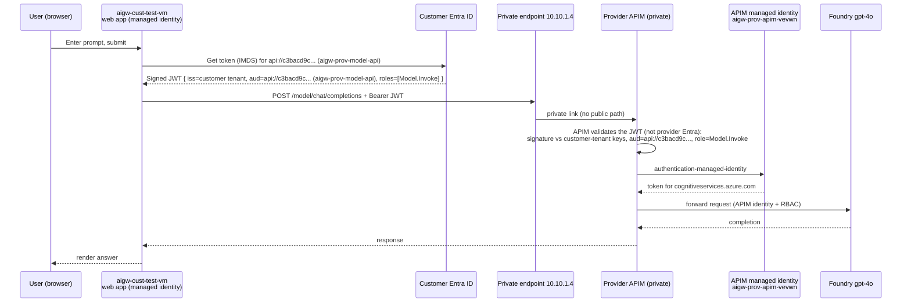

# Recording steps — Cross-Tenant AI Gateway demo

> Temporary file for the walkthrough recording. Delete when done.
> All names/IDs below are from the current deployment.
> This demo uses the **VM's managed identity** as the caller. The `aigw-cust-client`
> app registration (the CLI/secret path) is NOT part of this flow and is not shown.

## Deployed resources (this session)

| Side | Item | Value |
|---|---|---|
| Customer | Tenant | `89b9a646-a638-487d-809c-4513afcb12e9` (demoshaleet.onmicrosoft.com) |
| Customer | Subscription | `089e068e-38d9-42db-a644-d3d242fc31e1` (Pay-As-You-Go) |
| Customer | Resource group | `aigw-cust-rg` |
| Customer | Web page (VM) | http://172.176.159.238:5000 |
| Customer | VM (the caller) | `aigw-cust-test-vm` — system-assigned managed identity |
| Customer | Provider API (enterprise app) | `aigw-prov-model-api` — SP `191757d3-2478-4a0f-a031-49f3b5111c7f` |
| Customer | Private endpoint | `aigw-cust-apim-pe` → `10.10.1.4` |
| Customer | Private DNS zone | `privatelink.azure-api.net` |
| Provider | Tenant | `d832042c-0b39-4a9a-91f8-ef2b60153a96` (shaleenthapahotmail.onmicrosoft.com) |
| Provider | Subscription | `20f97081-6301-493e-a180-d9ee966c3c01` (VS Enterprise) |
| Provider | Resource group | `aigw-prov-rg` |
| Provider | APIM (private-only) | `aigw-prov-apim-vevwn` |
| Provider | APIM managed identity (calls Foundry) | `aigw-prov-apim-vevwn` — principal `d71ae4fb-a9f7-4572-ad54-f2e3d8d40b11` |
| Provider | API app (multitenant) | `aigw-prov-model-api` — `c3bacd9c-5cf2-4ba4-9467-df25d0d23932` |
| Provider | Audience / App ID URI | `api://c3bacd9c-5cf2-4ba4-9467-df25d0d23932` (aigw-prov-model-api) |
| Provider | App role | `Model.Invoke` — `7e026c83-25da-748c-eb20-c31fc709112b` |
| Provider | Foundry | `aigw-prov-foundry-vevwn` — model `gpt-4o` |
| Provider | Gateway URL | https://aigw-prov-apim-vevwn.azure-api.net/model/chat/completions |

---

## The auth flow (say this out loud)



**Who authenticates whom — one line each:**
1. **Customer Entra authenticates the VM** — it recognizes the managed identity `aigw-cust-test-vm` and issues it a token.
2. The token carries **`Model.Invoke`** because that role was granted to the VM identity on the provider API's enterprise app **in the customer tenant**.
3. **The audience is `api://c3bacd9c...` (aigw-prov-model-api)** — this points the token at the provider's API and nothing else.
4. **APIM authenticates the caller** — the APIM policy itself validates the JWT (signature against the **customer tenant's** keys, audience, and role). The provider's Entra / API app do **not** run at call time; they only defined the audience + role at design time.
5. **APIM authenticates itself to Foundry** — using its own managed identity `aigw-prov-apim-vevwn` (`d71ae4fb...`) + RBAC role `Cognitive Services OpenAI User`. No keys (Foundry local auth is disabled).
6. Nothing crosses the tenant boundary except the JWT + HTTPS over Private Link. The Foundry endpoint/keys never leave the provider tenant.

---

## Two concepts to explain on camera

### How does APIM "know" the caller?
APIM has **no list of client apps**. It trusts **Entra** and checks the **token**:
- **Signature + issuer** — policy says `tenant-id = customer tenant`, so APIM fetches the customer tenant's public keys and verifies the token was really signed there. Can't be forged.
- **Audience** — must equal `api://c3bacd9c...` (aigw-prov-model-api), proving the token was minted for this API.
- **Role** — `roles` must contain `Model.Invoke`.
Entra only stamps `Model.Invoke` into the token if that identity was **granted the role** (the app-role assignment). Remove the assignment → no role in the token → APIM returns 401. That assignment is the on/off switch.

### What is `api://c3bacd9c...`?
`c3bacd9c-5cf2-4ba4-9467-df25d0d23932` is the **Application (client) ID** of the provider API app registration **`aigw-prov-model-api`**. The `api://` form is its **Application ID URI** — its identity as an API, and the value that appears as the token **audience**.
- Provider tenant: **App registrations → aigw-prov-model-api → Overview** (the ID) and **Expose an API** (the `api://` URI).
- Customer tenant: **Enterprise applications → aigw-prov-model-api** (same app ID, consented as an enterprise app, SP `191757d3...`).

---

## PART 1 — Customer tenant (sign in as `shaleenthapa@demoshaleet.onmicrosoft.com`)

### 1. Show the working demo
- Open **http://172.176.159.238:5000**
- Type a prompt, click **Send through gateway**, show the `gpt-4o` answer.
- Narrate: "This page runs inside the customer VNet. It never sees a key — it authenticates as the VM's managed identity."

### 2. The calling identity (the VM)
- Portal → **Resource groups → `aigw-cust-rg` → `aigw-cust-test-vm` → Identity**
- Show **System assigned = On**, and note the **Object (principal) ID**.
- Narrate: "This managed identity is the caller. The customer tenant issues tokens to it — no secret stored anywhere."

### 3. The app-role grant (this is what puts Model.Invoke in the token)
- **Microsoft Entra ID → Enterprise applications → `aigw-prov-model-api`**
- **Users and groups** (or the app-role assignments) → show the **VM managed identity `aigw-cust-test-vm`** assigned **`Model.Invoke`**.
- Narrate: "The provider's API lives here as an enterprise app. We granted the VM identity the Model.Invoke role — that grant is exactly what lets Entra put the role into the token."

### 4. The private path
- Portal → **Resource groups → `aigw-cust-rg`**
- **`aigw-cust-apim-pe`** (private endpoint) → **Connection state = Approved**, private IP **10.10.1.4**.
- **`privatelink.azure-api.net`** (private DNS zone) → Recordsets → A record for `aigw-prov-apim-vevwn` → **10.10.1.4**.
- Narrate: "The gateway hostname resolves to a private IP inside our VNet. There is no public route."

### 5. (Optional) prove it on the VM
```powershell
ssh -i infra/terraform/customer/.ssh/aigw-cust-vm.pem azureuser@172.176.159.238 `
  "getent hosts aigw-prov-apim-vevwn.azure-api.net; sudo journalctl -u aigw --no-pager | tail -n 20"
```
- Show the hostname resolves to `10.10.1.4` and the app log shows a 200.

---

## PART 2 — Provider tenant (sign in as `shaleenthapa@shaleenthapahotmail.onmicrosoft.com`)

### 6. The API definition (multitenant + the role + the audience)
- Portal → **Microsoft Entra ID → App registrations → `aigw-prov-model-api`**
- **Overview** → note the **Application (client) ID** `c3bacd9c...`.
- **Expose an API** → note the **Application ID URI** `api://c3bacd9c...` (this is the token audience).
- **App roles** → show **`Model.Invoke`** (Allowed member types: Applications).
- **Overview** → **Supported account types = multitenant** (`AzureADMultipleOrgs`).
- Narrate: "This is the provider's API. It's multitenant, so the customer tenant can consent to it. This ID is the audience APIM checks for."

### 7. The gateway policy (the actual authentication)
- Portal → **Resource groups → `aigw-prov-rg` → `aigw-prov-apim-vevwn` (API Management)**
- **APIs → Model API → Design → Inbound processing → `</>` (code view)**. Show:
  - `validate-azure-ad-token` with `tenant-id` = customer tenant, `audience` = `api://c3bacd9c...`, required claim `roles` = `Model.Invoke`.
  - `authentication-managed-identity resource="https://cognitiveservices.azure.com"`.
  - `set-backend-service` → Foundry deployment URL.
- Narrate: "This is where the caller is authenticated — APIM itself validates the customer's token. Then it swaps in APIM's own identity for Foundry."

### 8. APIM is private + its identity
- APIM → **Network** → **Public network access = Disabled**; **Private endpoint connections** → the customer connection **Approved**.
- APIM → **Identity → System assigned** → show **Object (principal) ID** `d71ae4fb-a9f7-4572-ad54-f2e3d8d40b11`.
- Narrate: "No public access — inbound is only via the approved private endpoint. And this is APIM's identity that calls Foundry."

### 9. Foundry authorizes APIM (no keys)
- Resource group `aigw-prov-rg` → **`aigw-prov-foundry-vevwn`**
- **Access control (IAM) → Role assignments** → show **`Cognitive Services OpenAI User`** granted to **`aigw-prov-apim-vevwn`** (principal `d71ae4fb...`).
- **Resource Management → Keys and Endpoint** → note key auth is disabled (local auth off).
- **Model deployments** → show **`gpt-4o`**.
- Narrate: "Foundry trusts APIM by RBAC, not a key. The provider's model access never leaves this tenant."

---

## If the model were Anthropic (Claude) via Foundry
The **entire auth + private-link flow is identical** — VM identity in, APIM validates the JWT, APIM's managed identity to Foundry via RBAC, private-only. Only the **backend target inside APIM** changes:
- The **deployment name** (a Claude model instead of `gpt-4o`).
- The **backend path** (`set-backend-service` + `rewrite-uri`) points at the Azure AI model-inference path instead of the OpenAI path.
- The **request/response JSON shape** matches that API.
Two lines of policy + the deployment name — the cross-tenant security story stays word-for-word the same.

---

## Suggested recording order (fastest)
1. Part 1 → step 1 (show it working), then steps 2–4 (VM identity + role grant + private path).
2. Part 2 → steps 6–9 (provider API, policy, private APIM, Foundry RBAC).
3. Close on the mermaid flow: "customer identity in, provider identity to the model, private link between — no shared secrets."

## Cleanup after recording
```powershell
az account set --subscription 089e068e-38d9-42db-a644-d3d242fc31e1
terraform -chdir=infra/terraform/customer destroy
az account set --subscription 20f97081-6301-493e-a180-d9ee966c3c01
terraform -chdir=infra/terraform/provider destroy
```
